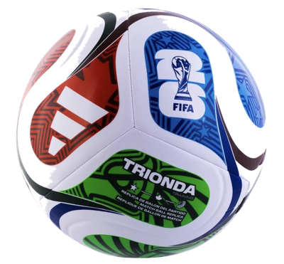

<div align="center">



# World Cup Match Lab

### *Predict matches. Build brackets. Spot upsets before they happen.*

[](https://python.org)
[](https://streamlit.io)
[](https://plotly.com)
[](LICENSE)
[](.github/workflows/ci.yml)

**An AI-powered prediction playground for the 2026 FIFA World Cup** — built to feel like ESPN meets DraftKings, not a data science notebook.

[**Live Demo**](https://worldcup-match-lab.streamlit.app) &nbsp;|&nbsp; [Features](#features) &nbsp;|&nbsp; [Quick Start](#quick-start) &nbsp;|&nbsp; [Architecture](#architecture) &nbsp;|&nbsp; [Contributing](#contributing)

</div>

---

## Author

**Harry Hunter, PhD, MPH**
[GitHub](https://github.com/hhunter-labs)

---

## Screenshots

| Home — The Odds Board | Predict Match — Live H2H | Build Bracket |
|---|---|---|
| *Insight cards that navigate* | *Auto-predicts as you change teams* | *4 simulation modes* |

| Upset Radar | Team Power Cards | Model Accuracy |
|---|---|---|
| *Ranked upset threats* | *Compare mode + radar chart* | *Qatar 2022 backtest* |

---

## Features

| Page | What it does |
|---|---|
| Home / The Odds Board | Live featured matchup + 6 insight cards that navigate to the right page with pre-loaded teams |
| Predict Match | Auto-predicts at 5ms as you change teams — no button needed. Shows win probabilities, xG, scoreline, confidence intervals, feature attribution, and a shareable card |
| Build Bracket | Full single-elimination simulation in Smart / Chaos / Dark Horse / Fan Favorite mode. Re-Roll for a different outcome |
| Upset Radar | Ranked upset alerts filtered by risk level — Chaos Alert, Banana Peel, Trap Game, Minor Risk |
| Team Power Cards | Deep-dive any team's attributes with radar chart + side-by-side Compare Mode for any two teams |
| Venue Vibes | Interactive geo map of all 16 2026 host cities with altitude, heat, and crowd energy analysis |
| Can My Team Win? | Monte Carlo finish distribution + verdict card + danger matchup for any of 32 teams |
| Model Accuracy | Qatar 2022 backtest: 63% overall accuracy, 81% knockout accuracy, calibration curve, model card |
| How It Works | System architecture, Poisson model, Monte Carlo simulation, LLM plug-in point |

---

## Quick Start

```bash
# Clone the repo
git clone https://github.com/hhunter-labs/fificup-2026-lab.git
cd fificup-2026-lab

# Create virtual environment
python -m venv venv
source venv/bin/activate        # Mac/Linux
# venv\Scripts\activate         # Windows

# Install dependencies
pip install -r requirements.txt

# Launch
streamlit run app.py
```

App opens at **http://localhost:8501**

---

## Architecture

```
Raw Data (CSV)
    │
    ▼
┌─────────────────────────────────────┐
│         Data Loader Layer           │
│  load_teams() · load_venues()       │
│  Graceful fallbacks · no crashes    │
└──────────────┬──────────────────────┘
               │
               ▼
┌─────────────────────────────────────┐
│       Feature Engineering           │
│  Composite power score · Elo norm   │
│  Rest-day adjustment · Altitude pen │
└──────────────┬──────────────────────┘
               │
               ▼
┌─────────────────────────────────────┐
│         Match Model                 │
│  Vectorized Poisson 8×8 matrix      │
│  Elo blend · Outcome probabilities  │
│  Bootstrap confidence intervals     │
│  Feature attribution (waterfall)    │
└──────────────┬──────────────────────┘
               │
               ▼
┌─────────────────────────────────────┐
│       Simulation Engine             │
│  Temperature-scaled analytic probs  │
│  Monte Carlo bracket (4 modes)      │
│  Champion probability estimation    │
└──────────────┬──────────────────────┘
               │
               ▼
┌─────────────────────────────────────┐
│       Explainability Layer          │
│  Rule-based analyst voice           │
│  generate_narrative() — LLM slot   │
└──────────────┬──────────────────────┘
               │
               ▼
┌─────────────────────────────────────┐
│         Streamlit UI                │
│  @st.fragment · session state nav   │
│  Custom CSS · Plotly · st.html()    │
└─────────────────────────────────────┘
```

---

## Project Structure

```
fificup-2026-lab/
│
├── app.py                      # Main entry point
├── requirements.txt            # Python dependencies
├── README.md                   # This file
├── LICENSE                     # MIT
│
├── data/                       # Sample datasets
│   ├── teams.csv               # 32 teams · 14 attributes each
│   ├── venues.csv              # 16 host cities · geo + climate
│   ├── sample_matches.csv      # 24 curated scenario matchups
│   └── qatar_2022_results.csv  # 44 Qatar 2022 actual results
│
├── src/                        # Business logic (modular)
│   ├── config.py               # Constants · labels · thresholds
│   ├── data_loader.py          # CSV loaders with inline fallbacks
│   ├── predictor.py            # Poisson model · Elo blend · CI · attribution
│   ├── simulator.py            # Bracket simulation · Monte Carlo
│   ├── backtester.py           # Qatar 2022 validation engine
│   ├── explainers.py           # Analyst narratives · LLM abstraction
│   ├── visualizations.py       # Plotly charts · geo map
│   └── ui_components.py        # CSS design system · HTML components
│
├── static/                     # Served by Streamlit static file server
│   └── ball.png                # FIFA 2026 Trionda ball (transparent bg)
│
├── scripts/                    # Utility scripts
│   └── fetch_elo_ratings.py    # Weekly Elo data refresh
│
├── tests/                      # Test suite
│   └── test_core.py            # 40 unit + integration tests
│
└── .github/
    ├── workflows/
    │   ├── ci.yml              # Lint + test on every push
    │   └── update_elo.yml      # Weekly Elo refresh
    ├── ISSUE_TEMPLATE/
    │   ├── bug_report.md
    │   └── feature_request.md
    └── PULL_REQUEST_TEMPLATE.md
```

---

## The Model

### Poisson Goal Model

Expected goals per team are computed from attack/defense ratings, rest days, venue altitude, and round pressure, then fed into a vectorized 8×8 score probability matrix:

```python
goals  = np.arange(8)
pmf_a  = poisson.pmf(goals, λ_A)   # (8,)
pmf_b  = poisson.pmf(goals, λ_B)   # (8,)
matrix = np.outer(pmf_a, pmf_b)    # (8,8) — 50× faster than nested loop
```

Win/Draw/Loss probabilities = triangular sums of the matrix.

### Elo Blend

Final outcome probabilities blend the Poisson model (70%) with Elo expected score (30%):

```
P(A) = 1 / (1 + 10^((Elo_B - Elo_A) / 400))
```

### Validation — Qatar 2022

| Metric | Result |
|--------|--------|
| Overall accuracy | **63%** (35 trackable matches) |
| Group stage | 47% |
| Knockout stage | **81%** |
| Upsets in data | 7 |

### LLM Plug-In

All narrative generation routes through a single abstraction in `src/explainers.py`. Swap one line to activate any AI provider — GPT-4, Gemini, or others:

```python
def generate_narrative(prompt, context, api_key=None):
    # Replace this line with any LLM call
    return _rule_based_narrative(prompt, context)
```

---

## Tech Stack

| Library | Version | Purpose |
|---------|---------|---------|
| Python | 3.9+ | Core language |
| Streamlit | 1.50 | UI framework + session state |
| Pandas | 2.0+ | Data manipulation |
| NumPy + SciPy | latest | Vectorized Poisson PMF |
| Plotly | 5.20+ | All charts + geo map |
| Pillow | 10.0+ | Ball image background removal |
| Anthropic SDK | 0.25+ | Optional AI narratives |

---

## Optional: AI-Powered Narratives

Add your Anthropic API key in the sidebar to activate AI-powered match previews:

```toml
# .streamlit/secrets.toml (never commit this file)
ANTHROPIC_API_KEY = "sk-ant-..."
```

Or toggle directly in the sidebar under **AI Match Previews**.

---

## Data Pipeline

Keep Elo ratings current with the weekly refresh script:

```bash
python scripts/fetch_elo_ratings.py
```

A GitHub Actions workflow (`.github/workflows/update_elo.yml`) runs this automatically every Monday at 6am UTC.

---

## Contributing

See [CONTRIBUTING.md](CONTRIBUTING.md) for development setup, code standards, and how to submit a pull request.

---

## Roadmap

- [ ] Deploy to Streamlit Community Cloud
- [ ] Real FIFA/Opta live data pipeline
- [ ] AI narrative generation (production)
- [ ] Full 48-team group stage simulation
- [ ] Player-level injury + lineup modeling
- [ ] Head-to-head historical records
- [ ] Shareable bracket links (URL params)
- [ ] Mobile-optimized responsive layout

---

## Disclaimer

All team ratings, predictions, and probability outputs use **sample data created for demonstration purposes only**. This project is not affiliated with, endorsed by, or connected to FIFA, the 2026 World Cup organizing committee, or any official football organization. Predictions are illustrative and should not be used for wagering or official analysis.

---

## License

MIT © 2026 Harry Hunter, PhD, MPH — see [LICENSE](LICENSE) for details.

---

<div align="center">
Built with Excitement &nbsp;·&nbsp; Python &nbsp;·&nbsp; Streamlit &nbsp;·&nbsp; Plotly &nbsp;·&nbsp; SciPy
</div>
